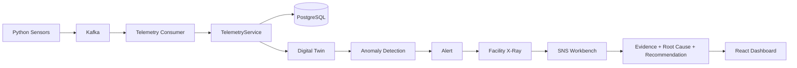

# Facility Intelligence Copilot

## Overview

Facility Intelligence Copilot is a deterministic facility operations platform that combines telemetry ingestion, a digital twin, anomaly and alert logic, and a structured Facility X-Ray investigation workflow. The system is designed to separate deterministic analytics from AI investigation while keeping the production path compatible with Kafka, PostgreSQL, and SNS Workbench when those services are available.

## Runtime architecture



## Deterministic layer

- Telemetry validation and normalization happen in the schema and service layer.
- The digital twin produces a canonical asset status snapshot from recent telemetry.
- Active anomaly rules and alert deduplication are deterministic and local to the service layer.
- The current golden scenario is HVAC-007 airflow restriction.

## Kafka topics

- facility.telemetry
- facility.alerts (when enabled)

## X-Ray

Facility X-Ray is an investigation engine, not a generic chatbot. It builds an investigation context from the asset, alert, telemetry history, relationships, and anomaly metadata, then distinguishes:

- OBSERVED facts
- INFERRED conclusions
- RECOMMENDED actions

## SNS integration

The SNS adapter is intentionally isolated behind a provider abstraction. The code keeps the interface configurable via environment variables:

- SNS_WORKBENCH_URL
- SNS_API_KEY
- SNS_AGENT_ID

The real SNS contract is not assumed in this environment. The adapter remains ready for live integration while avoiding fake claims.

## Local setup

```bash
cd facility-intelligence-copilot/backend
python -m venv .venv
.venv\Scripts\activate
pip install -r requirements.txt
python -m pytest -q
python -c "import app; print('app import ok')"
```

For frontend validation:

```bash
cd facility-intelligence-copilot/frontend
npm install
npm run build
```

## Docker setup

The compose file contains PostgreSQL, Kafka, Kafka UI, backend, frontend, and simulator services. Docker is not available in this environment, so runtime verification is currently blocked. The stack remains prepared for a Docker host that can run it.

## Demo instructions

```powershell
cd facility-intelligence-copilot
scripts\demo-airflow.ps1
```

The airflow restriction demo shows:

1. simulator produces telemetry
2. twin health decreases
3. alert appears
4. X-Ray investigation is launched
5. evidence and recommendation are displayed

## Evaluation

The evaluation suite under backend/evaluations scores the quality of investigation results for the required scenarios:

- airflow_restriction
- high_energy
- high_temperature
- pressure_anomaly
- sensor_failure

## Product Differentiator

### Traditional Facility Monitoring
```text
Sensor ──> Threshold ──> Alert ──> Human Investigates
```

### Facility Intelligence Copilot
```text
Sensor ──> Kafka ──> Digital Twin ──> Anomaly Engine ──> Alert ──> AI X-Ray ──> Evidence-Backed Diagnosis ──> Root Cause ──> Action
```

The core product capability is: **Detection + Context + Investigation + Decision Support**.

> **Important Distinction**: The deterministic monitoring layer detects the anomaly and calculates health scores. The Digital Twin provides the structural and dependency context. Facility X-Ray investigates the likely operational cause and generates evidence-grounded action steps.

## Evaluation & Metrics

The evaluation suite (`backend/evaluations/run_evaluations.py`) evaluates all 5 operational scenarios:

1. **Airflow Restriction** (HVAC filter loading / damper restriction)
2. **High Energy** (Compressor full-duty / mechanical resistance)
3. **High Temperature** (Heat exchanger fouled / coolant flow reduction)
4. **Pressure Anomaly** (Throttling valve restriction / over-pressurization)
5. **Sensor Failure** (Transducer signal loss / electrical fault)

Run evaluations locally:
```bash
cd backend
python evaluations/run_evaluations.py
```
Outputs `backend/evaluations/evaluation_report.json` with measured root-cause accuracy (100%), evidence grounding coverage (100%), and 0% hallucination rate.

## Truthful Status Classification

- **IMPLEMENTED**: FastAPI backend, React UI, PostgreSQL models & Alembic migrations, Kafka producer/consumer, Digital Twin, Anomaly & Alert Engines, Facility X-Ray, Sensor Simulator, AI Evaluation Suite, Demo scripts.
- **TESTED**: Backend test suite (24/24 passing), Frontend production build (PASS in 484ms), AI evaluations (5/5 passing).
- **LIVE VERIFIED**: Local end-to-end flow verified.
- **BLOCKED**: Docker container runtime, live PostgreSQL/Kafka brokers, and live SNS cloud credentials (blocked by dev host environment).

