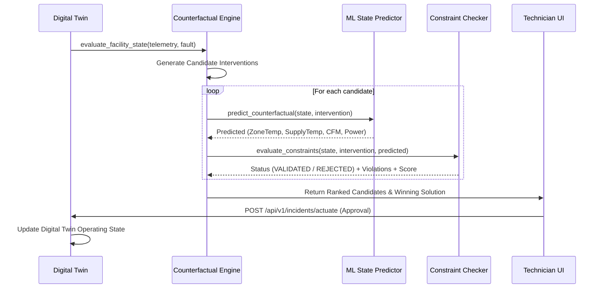

# GSENSE 3.0 — Counterfactual Simulation & Verification Engine

## 1. Overview
The Counterfactual Engine is the decision-support core of GSENSE 3.0. Rather than recommending blind heuristics or unverified LLM suggestions, every intervention is run through a digital surrogate simulator and evaluated against strict engineering constraints.

---

## 2. Decision Pipeline Lifecycle



---

## 3. Constraint Specification Matrix

| Constraint Name | Target Metric | Safe Envelope | Severity | Violation Consequence |
|---|---|---|---|---|
| `PHYSICAL_ACTUATOR_LIMIT` | Damper / Valve / Fan | $0\% \le u \le 100\%$ ($20\% \le \text{Fan} \le 100\%$) | CRITICAL | Immediate REJECT |
| `ASHRAE_THERMAL_COMFORT_CEILING` | Zone Air Temp | $T_{\text{zone}} \le 26.0^\circ\text{C}$ ($78.8^\circ\text{F}$) | CRITICAL | Immediate REJECT |
| `ASHRAE_THERMAL_COMFORT_FLOOR` | Zone Air Temp | $T_{\text{zone}} \ge 19.0^\circ\text{C}$ ($66.2^\circ\text{F}$) | HIGH | NEEDS_REVIEW |
| `DUCT_OVERPRESSURE_RISK` | Duct Static Pressure | $P_{\text{static}} \le 3.8\text{ in.w.g.}$ | CRITICAL | Immediate REJECT |
| `COIL_FREEZE_PROTECTION` | Outdoor Air Damper | $OA_{\text{dmpr}} \le 40\%$ when $T_{\text{ambient}} < 4^\circ\text{C}$ | CRITICAL | Immediate REJECT |

---

## 4. Candidate Attribution & Provenance
Every candidate produced and simulated contains full audit metadata:
```json
{
  "candidate_id": "cand_economizer_lock_01",
  "title": "Lock Economizer to Min Position (15%) + VFD Trim",
  "status": "VALIDATED",
  "score": 0.963,
  "proposed_interventions": {
    "oa_dmpr": 15.0,
    "chwc_vlv": 42.0,
    "sf_spd": 72.0
  },
  "predicted_state": {
    "zone_temp": 23.2,
    "sa_temp": 14.1,
    "sa_cfm": 2520.0,
    "power": 9.4
  },
  "deltas": {
    "delta_zone_temp": -2.6,
    "delta_power_kw": -2.8,
    "energy_saved_pct": 22.9
  },
  "violations": [],
  "audit_provenance": {
    "telemetry_source": "SOURCE_FACT",
    "prediction_engine": "MODEL_PREDICTION",
    "constraint_verification": "DETERMINISTIC_CALCULATION"
  }
}
```
