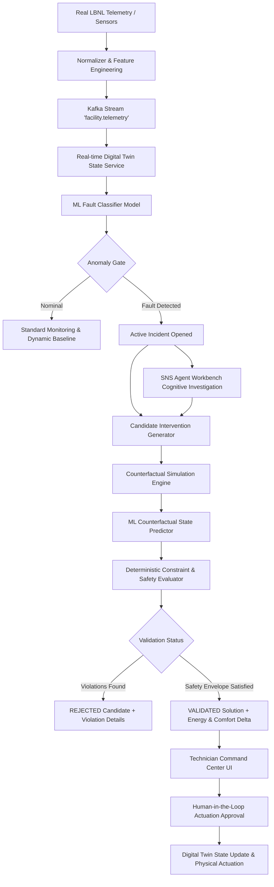

# GSENSE 3.0 — Facility Intelligence & Counterfactual Decision Support Architecture

## 1. Primary Product Concept
GSENSE 3.0 is a facility intelligence copilot for HVAC and commercial central plant operations. It converts raw high-frequency telemetry into **deterministic root-cause diagnoses** and **counterfactual what-if simulations** to recommend energy-saving and comfort-preserving interventions that can be actuated with human-in-the-loop validation.

---

## 2. Core Architectural Principles
1. **No Numerical Hallucination**: LLMs and cognitive agents are restricted to hypothesis formulation and natural language reasoning. Thermodynamic equations and state transitions are computed exclusively by calibrated ML models and deterministic physics.
2. **Strict Provenance Tracking**: Every data point in the system carries an explicit provenance tag:
   - `SOURCE_FACT`: Raw ground-truth sensor telemetry.
   - `MODEL_PREDICTION`: Output of calibrated scikit-learn / LightGBM regressors or classifiers.
   - `DETERMINISTIC_CALCULATION`: Physical calculation (e.g. coil Delta-T, electrical power equations).
   - `LLM_REASONING`: Hypothesis generated by SNS multi-agent cognitive copilot.
3. **Deterministic Constraint Guardrails**:
   - ASHRAE Standard 55 thermal comfort band ($19.0^\circ\text{C} \le T_{\text{zone}} \le 26.0^\circ\text{C}$).
   - Duct acoustic & static pressure ceiling ($P_{\text{static}} \le 3.8\text{ in.w.g.}$).
   - Coil anti-freeze limit (damper $\le 40\%$ when $T_{\text{ambient}} < 4^\circ\text{C}$).
   - Physical actuator limits ($0-100\%$).

---

## 3. Subsystem Breakdown

### 3.1 Machine Learning Subsystem (`backend/ml/`)
- **Features (`backend/ml/features/`)**:
  - `feature_schema.py`: Canonical sensor channel definitions and bounds.
  - `feature_engineering.py`: Computes thermodynamic coil $\Delta T$, mixed air economizer ratio, airflow-to-speed ratios, and simultaneous heating/cooling friction.
- **Training (`backend/ml/training/`)**:
  - `prepare_dataset.py`: Ingests LBNL SDAHU dataset (`AHU_annual.csv`, fault test runs).
  - `train_fault_model.py`: Trains multi-class `HistGradientBoostingClassifier` (Accuracy $> 99.9\%$).
  - `train_state_model.py`: Trains multi-target regressors predicting equilibrium next-state ($R^2 > 0.997$).
- **Inference (`backend/ml/inference/`)**:
  - `fault_predictor.py`: Calibrated real-time fault identification and root-cause indicator attribution.
  - `state_predictor.py`: Predicts resulting zone temperature, supply air temperature, airflow CFM, and power kW under hypothetical actuator changes.

### 3.2 Counterfactual Engine (`backend/counterfactual/`)
- `schemas.py`: Pydantic models for candidates, constraints, deltas, and audit provenance.
- `constraints.py`: Hard safety and comfort boundary checking.
- `candidate_generator.py`: Synthesizes candidate actions per diagnosed root cause.
- `simulator.py`: Executes ML state prediction for each candidate branch.
- `evaluator.py`: Classifies each candidate into `VALIDATED`, `REJECTED`, or `NEEDS_REVIEW`.
- `engine.py`: Top-level orchestrator returning ranked decision matrices.

### 3.3 Digital Twin & APIs (`backend/app/services/` & `backend/app/api/v1/routes/`)
- `digital_twin.py`: In-memory twin maintaining physical history, health scoring, and counterfactual branch evaluation.
- `routes/counterfactual.py`: REST endpoint `POST /api/v1/counterfactual/evaluate`.
- `routes/incidents.py`: REST endpoints `GET /api/v1/incidents/active` and `POST /api/v1/incidents/actuate`.

### 3.4 Technician Command Center UI (`frontend/src/`)
- `CounterfactualSimulationTile.tsx`: Responsive Bento Grid tile rendering validated solutions, rejected candidates with violation badges, and one-click technician actuation.
- `counterfactualService.ts`: Real-time frontend API client with type safety.

---

## 4. Verification & Testing
All backend services and frontend components are verified with automated test suites:
- Backend: `pytest backend/tests` — 27/27 tests passing.
- Frontend: `npm run build` — Clean compilation with Vite 8 + TypeScript.
